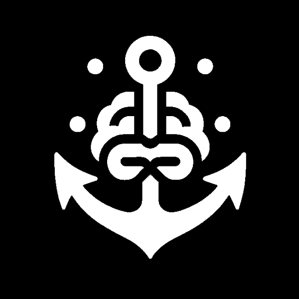

<p align="center">
  <picture>
      
    </picture>
    <h1 align="center">MindAnchor</h1>
</p>

## Getting Started

MindAnchor is a Next.js app that allows users to create and categorize ideas, as well as setting them to be presented at a certain time of day.

## Installation

1. First, run `npm install` to install all the project's dependencies.

2. Create a .env file in the root dir:

```
DATABASE_URL="database url"
NEXT_PUBLIC_API_BASE_URL="http://localhost:3000"
AUTH_SECRET=auth js secret key (https://authjs.dev/getting-started/installation)
NEXTAUTH_URL=http://localhost:3000
CONFIRMATION_EMAIL="Email you send confirmations from"
CONFIRMATION_EMAIL_PWD="Password for the email"
SMTP_SERVER="smtp.gmail.com"
```

3. After the DB is up run `npx prisma migrate dev`

First, run the development server:

```bash
npm run dev
# or
yarn dev
# or
pnpm dev
# or
bun dev
```

Open [http://localhost:3000](http://localhost:3000) with your browser to see the result.

## Structure